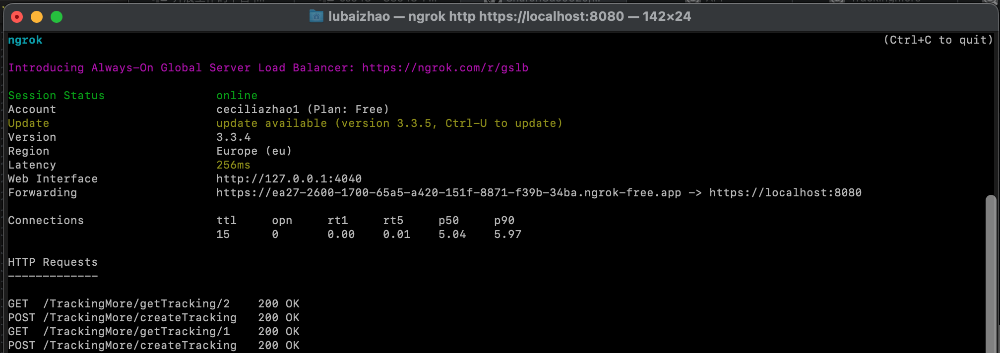
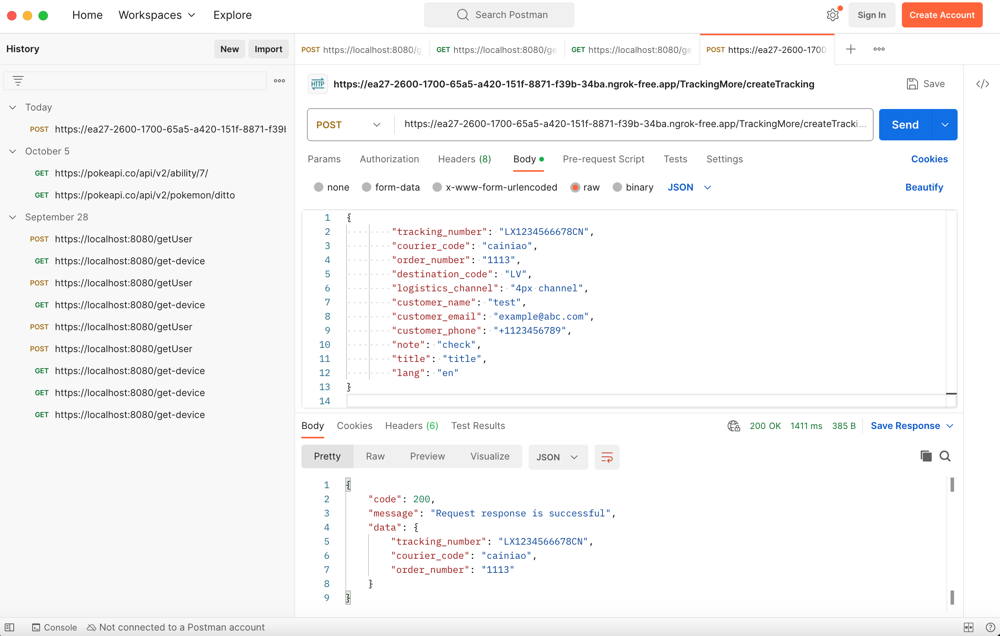

# TrackingMore API

## Design

Using trackingmore api, in details using tracking number to get shipment status. Posted data will be saved to dataTM.json.


**API:**
* **TrackingMore**
  * [Create Trackings](https://www.trackingmore.com/v3/api-index.html?language=Nodejs#create-trackings) from **[TackingMore](https://www.trackingmore.com/)**
  * [Get Result](https://www.trackingmore.com/v3/api-index.html?language=Golang#get-results) from **[TackingMore](https://www.trackingmore.com/)**.
    


## Implementation

### 1. Project Setup
* Using NodeJS express framework
  * Create a folder for the project and go to the project folder
  * Initialize the nodejs project by:
  ```
  $ npm init -y
  ```
  * Install needed packages
  ```
  $ npm install express axios winston luxon dotenv node-fetch
  ```

* Create .env file to store variables


## TrackingMore
### 1. Create a Tracker

API used in this section is **[Create Trackings](https://www.trackingmore.com/v3/api-index.html?language=Nodejs#create-trackings)**

In this section, we post the data through the API to create a tracker information.

<br>

* Request Parameters:


* API URL:

[https://my.trackship.com/api/create-tracker/customapp/](https://api.trackingmore.com/v3/trackings/create)


### 2. Save Data
With the data posted in previous section, create a method to save the data to data.json file which removes duplicate data and save data set in order of order_id.


### 3. Get Tracking Details
* API tested in this section is:

  1. [Get Result](https://www.trackingmore.com/v3/api-index.html?language=Golang#get-results) from **[TackingMore](https://www.trackingmore.com/)**

* In this section, the program will do:

  1. use the order_id parsed from the URL to filter throught data.json file to get the tracking number and provider for the specific order_id.
     
  2. Use the tracking number and provider information as parameters to call the tracking API to get the shipment status.

* API URL:
https://api.trackingmore.com/v3/trackings/get?tracking_numbers=

## Run Project

```
$ npm start
```

* **On another terminal**

```
$ ngrok http https://localhost:8080
```


## Test Results
Testing the project using Postman.


### TackingMore API

* **Create a Tracking:**
  


* **Get a TrackingID:**


* **Data Saved:**


* **Get Shipment Status:**


### logger


* TackingMore API


### TrackingMore Preview


